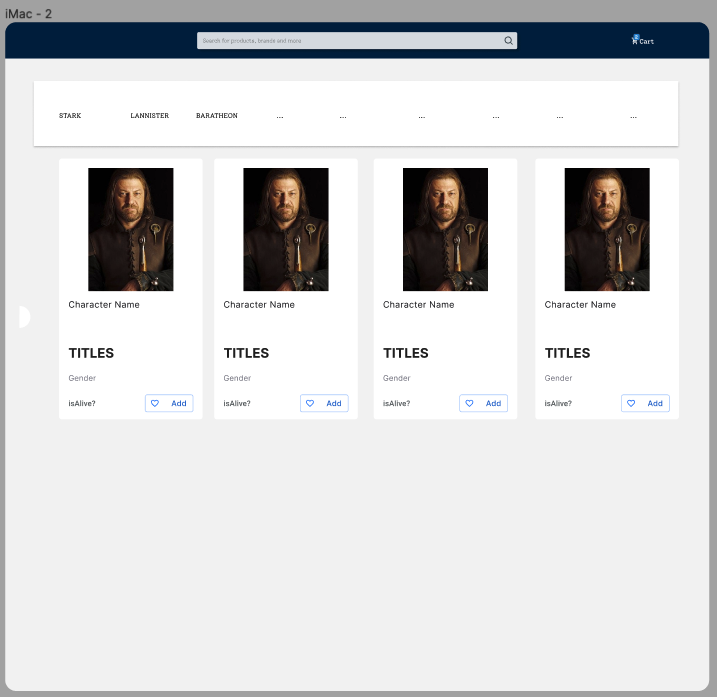

# Challenge Frontend - React
Convert the following design to a Single Web Application (SPA):

[Figma](https://www.figma.com/file/szAbOw9emV2pQE3WfWstcf/Shoppy-app-ui-(Community)?node-id=103%3A2)

## Technology stack
You are expected to use the following:
    - Use ([React](https://reactjs.org/))
    - Library for state management (for example Redux, Vuex);
    - SCSS syntax for page styles using SASS or LESS;
    - ECMAScript 6 for JavaScript.

## Instructions
- Fork this project, work and make a pull request when you're done
- Consulting the [API](https://dummyproducts-api.herokuapp.com/) you must do the following tasks:
    - List the 9 first departments available in (/api/v1/departments) below the topbar (choose the image that fits the best)
    - When the user clicks in one of the departmens a filter should be done and the result should be listed
        - Product Name, Product Type, Price, Stars, Image and the product with the less value in the list should have the tag "`50% OFF`"
    - When the user search a product in the search bar, the expected result should be a filter with the input consulting the API
    - When the user clicks "Add" the product should be added to the cart (changing it's number only)    

## Requirements
- The website must be compatible with: Firefox, Chrome, Edge browsers;
- Your application must be responsive (we did not create a mobile design version because we want to see your solution to this problem)
- Unit tests
- **Deploy your application on a free host service and add the public link on this file**

## How we review
The submitted code will be evaluated for the following aspects:

- **Design.** How is the design implemented, is there any differences in how we see it? Do you use mobile first design pattern?

- **Compatibility.** Does the design look more or less the same in all of the browsers? Is it responsive on all the screen sizes? Does the application look good on mobile?

- **Architecture.** How are the files structured? Does the file names match the contents of it?

- **Code Quality.** Does the code run without errors? Do you handle errors? How well HTML semantics are used? How is the CSS/Javascript implemented? Do you make separate commits for different features?

## Tips
- We ❤️ animations, code coverage and end-to-end tests